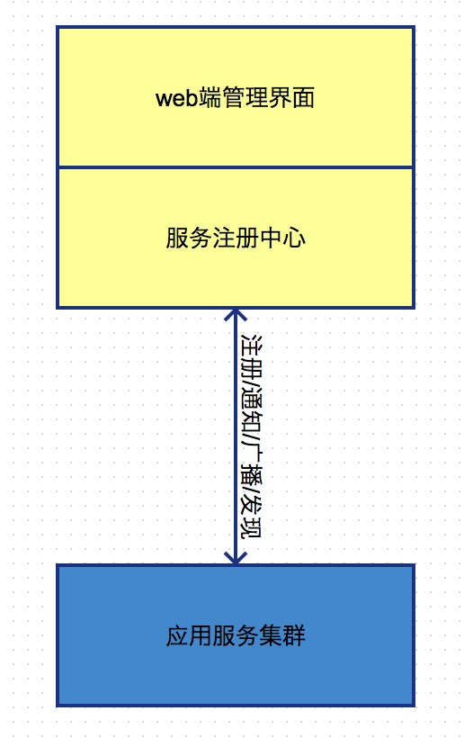

## 第一章节 服务治理中心
服务治理的管理平台  

### 1.1 应用服务的注册
应用服务自身基本信息的上报 一般跟随启动时注册 应用服务区别化  
场景例子:  
1) 告知收集应用服务器/应用容器信息(如:应用服务名,应用服务描述,应用服务ip/域名,各版本信息等)   
2) 治理中心进行上次比对是否有更新 版本的变化 对于无状态的k8s容器则以
填充方式

### 1.2 治理中心发现应用服务
服务治理中心可针对容器进行监控或心跳机制监测应用服务  
可动态发现服务是否存在上线下线或部署等状态  
场景例子:  
1) 通过心跳机制或监控方式探知应用服务的情况及状态  
2) 针对各种情况状态做出相应操作 如异常或宕机使其下线或降级

### 1.3 应用服务通知治理中心
当应用服务发生变化或者下线降级操作时 通知治理中心其现在状态  
场景例子:  
当应用服务自身发生变化时 如下线配置变化 磁盘写满 无法连接数据库中间件等 则先通知服务治理中心 让服务治理中心做出相应操作  

### 1.4 治理中心广播应用服务
当应用服务发生变化 广播至与其有关联的应用服务  
场景例子:  
1) 治理中心得知应用服务有所变化 如需广播的情况下 则广播至有关联的应用服务  
2) 如订单服务升级 则应通知商品物流支付或其他相关业务正在部署升级或灰度下线了那些容器

### 1.5 治理中心权限管理
治理中心管理平台自身管理员的权限管理以及应用服务的权限管理  
场景例子:  
1) 如财务版块应用不是所有应用可以访问 则需要设置权限  
2) 管理员需分角色 开发 架构师 运维等所呈现界面则应不同

