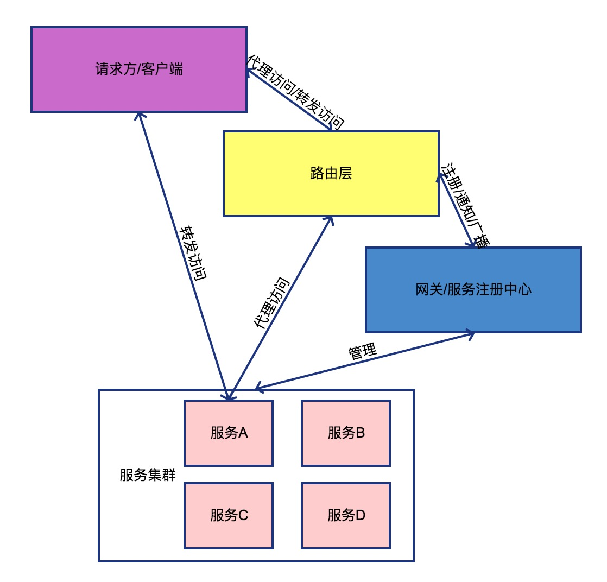

## 第十章节 路由与网关
由于应用服务存在多个 无法归纳统一对外访问地址 造成对外接口特别复杂   
所以针对于业务层面 需要一个入口层 一般我们称其为路由层

### 10.1 动态路由
路由层为入口层 一般会为其设置host(域名) 达到统一访问地址 通过请求的解析 找到所需要的服务群 执行请求并转发或者代理到需要的服务 返回请求所需的结果  
动态路由的含义则是在无需对路由层更改的情况下 路由可通过网关或服务治理中心得知到新的服务  
场景例子:  
1) 通过对外统一域名 通过外部请求解析到具体的内部服务路由  
2) 开放式平台 OAUTH安全验证 统一内部接口  
3) 对外webservice接口(如银行证券等) soap验证 统一内部接口  
4) 需要加密场景 对客户端与服务端的对称加密  

### 10.2 网关模式
路由可包含网关层 也可抽离 网关主要能快速定位到所需访问的服务 同时网关层有负载均衡及放量控量等功能  
场景例子:  
1) 多节点的负载均衡
2) 灰度上线 控制放量到灰度的实例  
3) websocket负载(如用golang) 业务分离(业务由其他语言执行)  

 <a href="subject-9.md">上一章节</a>  <a href="subject-11.md">下一章节</a>

