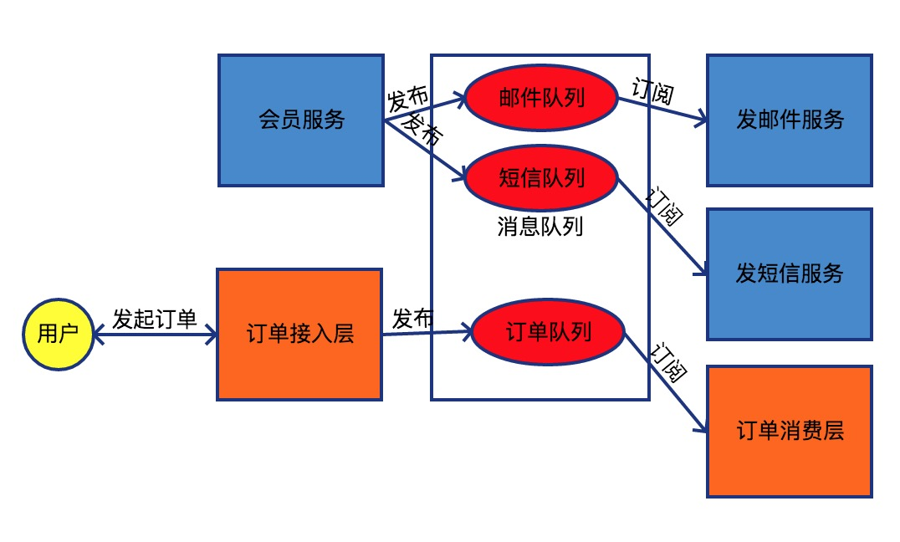

## 第十一章节 事件总线与消息队列
事件总线是一个概念 消息队列是事件总线的一种实现 通过消息队列来达到业务分离 也可使业务串行并行化  

### 11.1 事件总线
事件总线是一种概念 通常有发布订阅模型 乒乓模型 Actor模型等 常用实现框架有Disruptor JActor EventBus等  
常用的发布订阅模式是事件总线的一种实现 它是一种集中式事件处理机制 允许不同的组件之间进行彼此通信而又不需要相互依赖 达到一种解耦的目的
场景例子:  
1) amqp消息队列   
2) 网络proactor/reactor模型  
3) request response模式(java的servlet模式)  
4) 异步协程模型 callback/promise/async模式等  
5) 通过异步模型引申出的rx/stream模型

### 11.2 消息队列
消息队列是一种通信工具 可以在机器之间互相传输消息文件等 扮演着一种消息路由的角色 拥有一套完备的路由机制来决定消息传输方向 发送段只需要向消息总线发出消息而不用管消息被如何转发  
消息队列中间件是分布式系统中重要的组件 主要解决应用耦合 异步消息 流量削锋  
消息队列的实现的中间件常用的amqp协议的有activemq/rabbitmq等 非amqp有kafka/redis等  
场景:  
1) 用户注册完成后需认证 可以对消息中间件发送请求 短信邮件服务消费 进行发短信发邮件并行处理  
2) 流量削锋 12306订票  
3) 应用解耦 电商系统(库存服务 订单服务 会员服务 物流服务)  
4) 异步执行模型 离线任务等  
5) 任务堆积 任务调度 定时执行  

 <a href="subject-10.md">上一章节</a>  <a href="subject-12.md">下一章节</a>