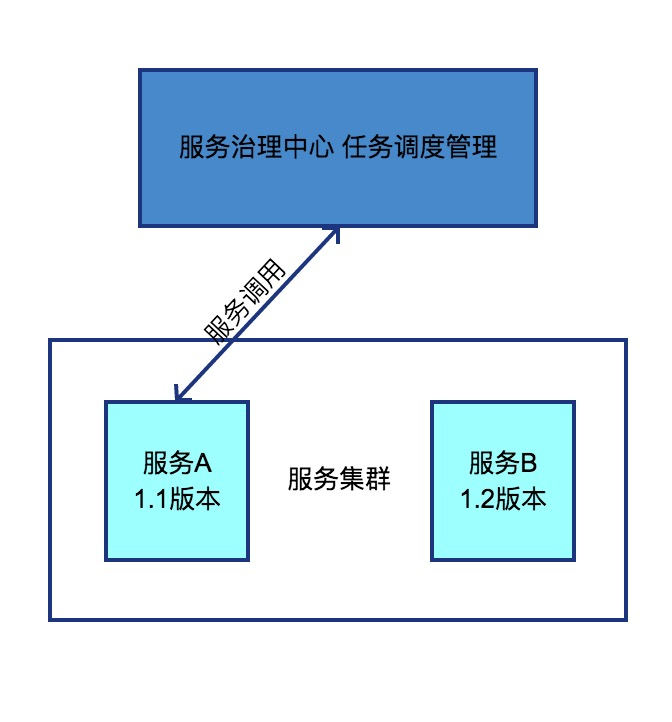

## 第十二章节 计划任务
在系统中 经常会制定一些计划任务 在某个时间点做某件事情 核心是以时间为关注点 即在一个特定的时间点 系统执行指定的一个操作 

### 12.1 任务调度
任务调度涉及多线程并发 线程池维护 运行时间规则解析 任务链路追踪 运行时长基准 日志收集 运行保护 重试恢复等  
场景例子:  
1) 定时发送活动短信/邮件   
2) 大数据相关 如离线计算用户喜好  
3) 脏数据冗余数据清理  
4) 定时同步数据库和缓存  
5)  

### 12.2 调度管理
在服务治理中心管控这些任务  
基本功能创建任务(根据设置调用的版本 会自动找相应的服务) 发起任务 调用任务接口 任务的运行时长跟状况 运行错误报警 任务运行日志的收集查看 重新发起任务等等一系列的管控任务的功能