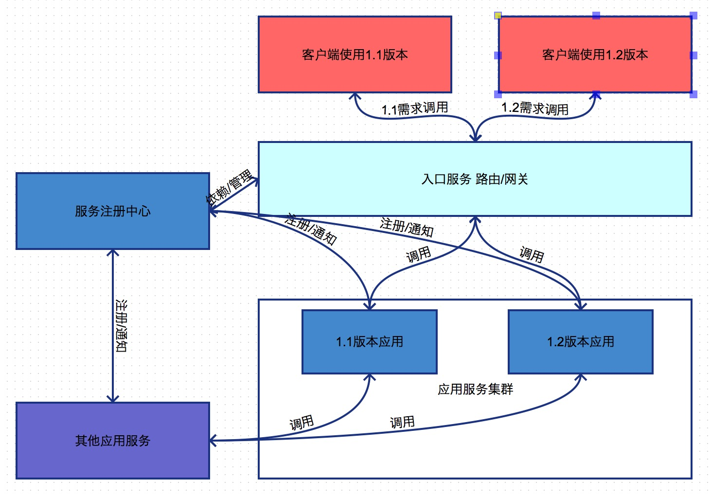

## 第五章节 应用版本
应用的版本管理 需上报到服务治理中心  

### 5.1 多版本共存
应用服务集群中会存在多个版本  
场景例子:  
1) 多节点灰度部署  
2) 上线出现问题执行回滚   
3) 客户端/其他业务调用不同版本的服务端 版本差异化  

### 5.2 版本差异使用
非强制要求其他服务或客户端升级时 就存在多个版本差异化的使用  
通过服务治理中心得知具体版本的节点则调用使用  
场景例子:  
1) 客户端/内部系统多个版本 不同版本调用不同的应用服务  
2) 内部系统调用未及时升级会对上一次版本或之前的版本有依赖  
3) 用户使用端未更新调用历史版本的接口

### 5.3 版本管理
通过服务治理中心 提前通知告知与其有调用关联的其他服务  
如下个版本不在提供那些版本的服务 让其及时升级新的使用版本服务  
场景例子:  
1) 依赖业务/客户端调用新老版本时 提示警告或转发  
2) 通过路由来过滤 指定到某个特定版本  
3) 接口字典查询 用版本来定位所需查询的接口  
