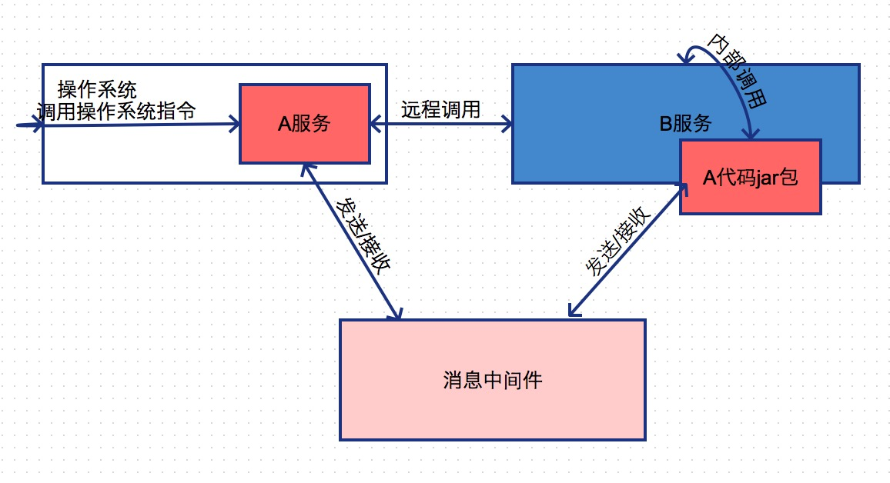

## 第七章节 应用调用接口
应用之间的如何调用接口 通常分为远程调用与内部调用 还有以消息中间件形式异步调用  

### 7.1 远程调用
远程调用 两个独立应用(集群)间的调用 常用协议tcp restful webservice thirft等  
场景:  
1) 订单模块调用商品/支付/物流模块  
2) 路由模式 客户端对路由层发送请求 路由层对内部服务发送请求   
3) 任务调度 调用业务接口的定时任务  

### 7.2 内部调用
内部本地方法调用 进程内调用 如java以jar包形式反射调用 命令调用系统底层  
场景:  
1) A应用集群宕机 B需要调A切换至内部反射用A的引入的jar包  
2) 图形服务 原本使用第三方系统处理 第三方系统出错 则使用自己本地的图形处理方式  

### 7.3 消息中间件调用
应用服务发送至消息中间件直接返回 其他应用再去把消息中间件上的消息处理 非即时处理 具体可参见 第十一章节 事件总线与消息队列  
场景:  
1) 订单完成 因其订单无需即时物流反馈 则可通过消息中间件异步发送到物流平台  
2) 12306抢票 抢票发送至消息中间件 再由订票系统去处理 处理完后得知是否抢票成功  
3) 应用产出日志 发送至消息中间件 日志系统可缓冲收集清洗日志  

 <a href="subject-6.md">上一章节</a>  <a href="subject-8.md">下一章节</a>